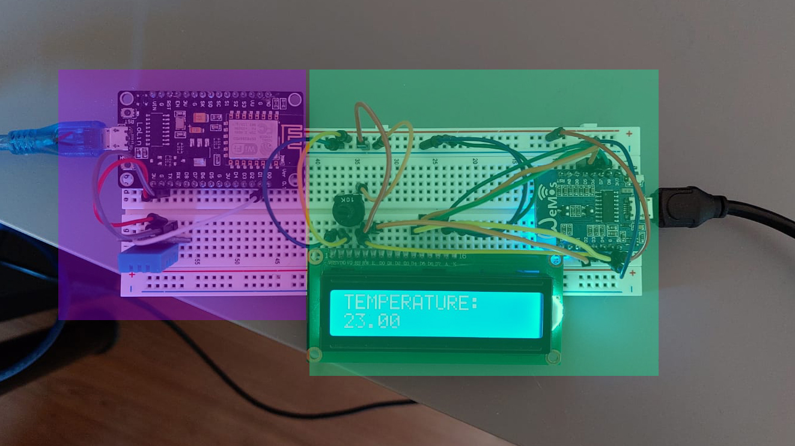

# WiFiThermometer
> WifiThermometer enables users to transfer (sensor) data between two ESP8266 microcontrollers while utilizing an existing WiFi network.

My grandpa has a lovely little balcony. He would like to know the outside temperature without actually going outside. Sounds simple enough, but thick concrete walls make it impossible for any 433 MHz low-power radio signal to penetrate. Simply buying an off-the-shelf wireless thermometer is hence not an option. Also, why bother placing an analog thermometer outside and walking to the window... if you can task your grandson and aspiring electrical engineer with developing an unnecessarily complicated solution?

In true engineering fashion, I postponed this project for months. The idea was to develop a system that transfers data using my grandpa's WiFi network. The WiFi signal is strong enough to be measurable on the balcony (gotta read that Facebook while sitting outside), so a solution that utilizes the existing WiFi network could be viable. 

Initially, this project idea may seem simple, but designing the final system was rather tricky. I had to overcome various struggles, ranging from faulty data cables (grrr) to finding the internal IP address of a router. Luckily, you can just steal my code and start playing with it right away. The result is a system consisting of two components: a *client* that measures the temperature using a DHT11 sensor and a *server* that receives the temperature reading and projects it on a 1602 LCD. Feel free to use this project as a template for other wireless transmission ideas: the only limitation is your imagination.

## Hardware setup

For my version of the system, you will need:
- two ESP8266 boards, of which at least one should be able to handle a 5V output
- DHT11 temperature sensor (a newer generation is also fine)
- 1602 LCD with necessary potentiometer to adjust the brightness
- wires, breadboard, and suitable power supplies

### Server setup
The server is responsible for receiving the sensor values from the client and displaying them on an LCD screen. Use a 5V board for the server, since the display requires 5V to work.

Connect the LCD screen:
- VSS to GND
- VDD to 5V
- V0 through potentiometer to GND
- RS to D3
- RW to GND
- E to D2
- D4 to D4
- D5 to D5
- D6 to D6
- D7 to D7
- A to 5V (check if a current limiting resistor is required)
- K to GND

### Client setup
The client is responsible for reading the sensor values and sending them to the server. You can use a 3.3V or a 5V board for this task.

Connect the DHT11 temperature sensor to the board. Connect power to power, ground to ground, and the signal pin to an arbitrary digital pin of the ESP8266.

That's all there is!



## Software setup

Fire up your Arduino IDE!

### Server setup
Connect your ESP8266 to your laptop or computer. Open the `server.ino` script. 

Change 

```
char ssid[] = "SSID";
char pass[] = "PSSWRD";
```

to your network credentials.

Change `IPAddress ip(192, 168, 178, 155);` to the IP address that you want the server to use in your network. Make a note of this address, because you will need it later. Choose an IP address that is currently unused and/or that is outside your router's DHCP range. Pro tip: use your router's DHCP to assign a static IP address to the MAC address of the ESP8266. The MAC address will print in the console and on the 1602 LCD screen during the start-up cycle if `server.ino` is run. 

Lastly (**and this is very important**), change your gateway and subnet:
```
IPAddress gateway(192,168,178,1);           // gateway of the WiFi network --> see router, or router's manual
IPAddress subnet(255,255,255,0);          // subnet mask of Wifi network --> see router settings, or router's manual
```
The gateway is the internal IP address of the router. **This can differ between models, and the system will not run with an incorrect gateway.** You can find the gateway IP in the router's manual or online. The subnet can be found in the router settings.

### Client setup
Connect your ESP8266 to your laptop or computer. Open the `client.ino` script. 

Again, change 

```
char ssid[] = "SSID";
char pass[] = "PSSWRD";
```

to your network credentials.

And change `IPAddress server(192,168,178,155);` to the IP address that you noted down during the set up of the server. Use `#define DHTPIN 5` to describe the pin where you attached the temperature sensor. Warning: use a pin layout diagram to determine the pin number. In this case, `5` means `D1`. `#define SLEEP_TIME 120` (in seconds) can be changed to alter the time between measurements. 

## Usage
Once set up and powered on, the system will run as long as the server and the client can receive the WiFi network. During a transfer, the client draws around 0.02A at 5V, and the server draws around 0.05A at 5V. Your mileage may vary depending on e.g. the used microcontrollers, but powering the system from batteries is definitely an option.

## Limitations
The most significant limitation is that only one sensor can be used. If we were to broadcast temperature **and** humidity, for example, the server would not know which received value corresponds to temperature, and which to humidity. Since this was a project for fun, I am not going to implement a script that works with multiple sensor readings. It would make for a fun engineering challenge, though. My approach would be to append something to every transfer, and use the appended piece to figure out what kind of data was sent.


## Sources and acknowledgments 
[I used this Instructable from Gyalu1 for parts of the wireless communication.](https://www.instructables.com/WiFi-Communication-Between-Two-ESP8266-Based-MCU-T/)

[And I recycled parts of my own code for the temperature readings.](https://github.com/StachRedeker/Temperatuurgevoelige-Ventilator)

[Lastly, if you live in the Netherlands, this could be a helpful start in determining the router's IP address.](https://www.wifiwijs.nl/ip-adres-router/)
